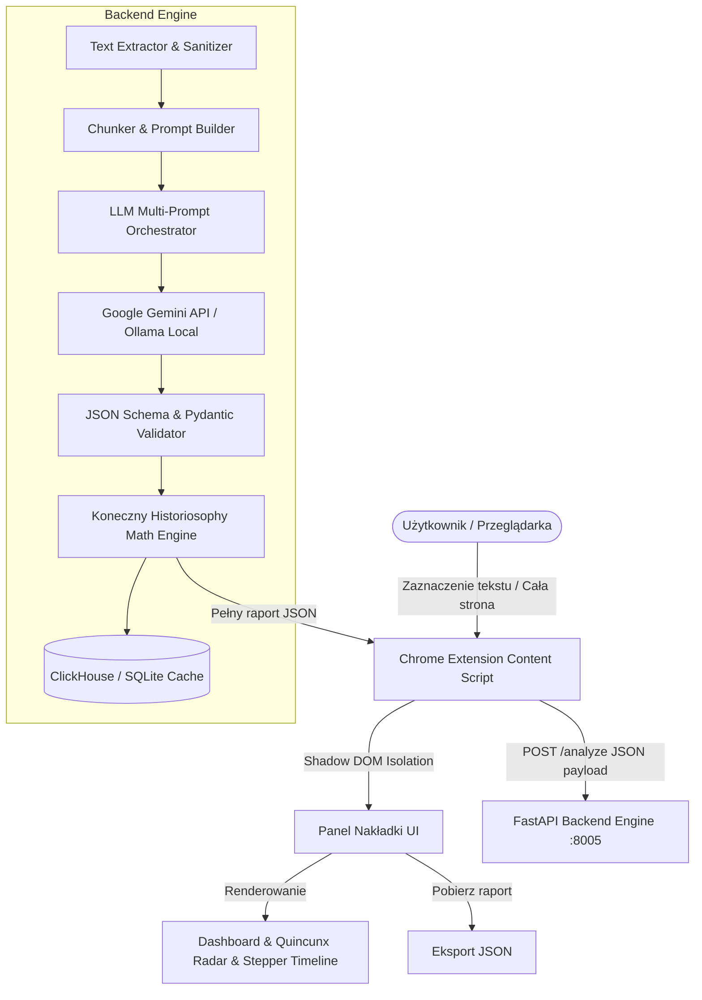
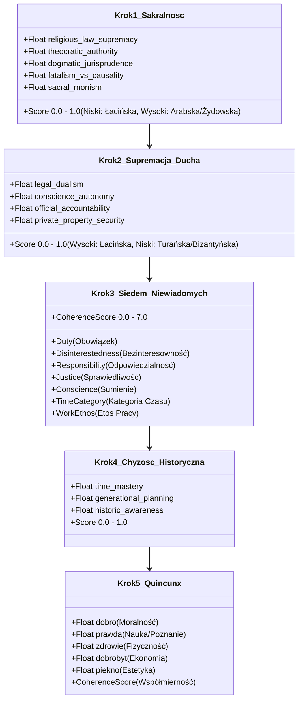
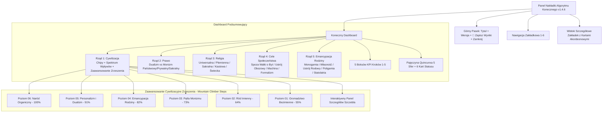

# 🏛️ DESIGN DOCUMENT: ALGORYTM KONECZNEGO
### *Cyfrowe Narzędzie Analizy Historiozoficznej i Komparatystyki Cywilizacyjnej*

---

## 1. Wprowadzenie i Cel Systemu

**Algorytm Konecznego** to zaawansowany system analityczny oparty na metodzie historiozoficznej profesora Feliksa Konecznego (1862–1949). Narzędzie przekształca teoretyczne monografie badacza w indukcję cyfrową: analizuje dowolny tekst źródłowy (artykuły, ustawy, konstytucje, orzeczenia sądowe, manifesty, transkrypcje) i określa jego profil cywilizacyjny, stopień sakralizacji, supremację ducha, spójność etyczną (Siedem Niewiadomych), wydajność historyczną, współmierność Pięciomianu Bytu (Quincunx) oraz obecność kłamstwa cywilizacyjnego.

---

## 2. Architektura Wysokiego Poziomu (High-Level Architecture)

System składa się z trzech ściśle zintegrowanych warstw:
1. **Warstwa Klienta (Extension / Frontend Overlay)** – Rozszerzenie przeglądarki Chrome działające w izolowanym Shadow DOM, generujące interaktywny dashboard i wizualizacje.
2. **Warstwa Logiki i Serwera (FastAPI Backend Engine)** – Asynchroniczny silnik w Pythonie parsujący tekst, orchestrator zapytań LLM, walidator schematów Pydantic oraz moduł wyliczania metryk Konecznego.
3. **Warstwa Modelu Językowego i Pamięci (LLM & Data Tier)** – Integracja z Gemini API / Ollama / mockami deterministycznymi oraz baza ClickHouse / SQLite dla statystyk i pamiątek dziejowych.



---

## 3. Potok Przetwarzania Historiozoficznego (5 Kroków Metody Indukcyjnej)

Przetwarzanie tekstu w silniku analitycznym realizowane jest ściśle według założeń naukowej metody Konecznego:


### Szczegółowa specyfikacja kroków:



---

## 4. Architektura UI Dashboardu i Modułów Wizualnych

Dashboard w nakładce Chrome (`extension/content.js`) jest podzielony na ergonomiczne sekcje informacyjne:



---

## 5. Matryca Klasyfikacji Cywilizacji i Ustrojów

Poniższa tabela przedstawia zasady indukcyjnej kategoryzacji tekstu przez algorytm:

| Cywilizacja | Supremacja Ducha | Sakralność | Prawo | Religia | Rodzina i Majątek | Czas i Praca |
| :--- | :---: | :---: | :--- | :--- | :--- | :--- |
| **Łacińska** | **Wysoka (>50%)** | **Niska (<30%)** | **Dualizm Prawny** (prywatne + publiczne) | Uniwersalna etyczna (autonomia sumienia) | Monogamia dożywotnia, pełna emancypacja, własność prywatna | Czas linearny, praca wolna i celowa |
| **Bizantyńska** | Niska (<45%) | Niska | **Monizm Prawa Publicznego** (państwowy) | Państwowa / Podporządkowana | Rodzina zdominowana przez biurokrację i etatyzm | Czas mechaniczny, praca regulowana ustawą |
| **Turańska** | Bardzo niska (<30%) | Niska | **Monizm Prawa Prywatnego** (władcy) | Areligijność / Formalizm | Rodzina w ustroju obozowym, brak stabilnej własności | Czas doraźny, praca przymusowa / wojenny podbój |
| **Arabska** | Średnia/Niska | **Bardzo wysoka (>60%)** | **Monizm Sakralny** (Szariat/Teokracja) | Państwowa / Sakralna | Poligamia dopuszczalna, brak pełnej emancypacji majątkowej | Fatalizm dziejowy, rytuał ponad pragmatykę |
| **Żydowska** | Specyficzna | **Wysoka (>50%)** | **Monizm Prawno-Sakralny** | Narodowa / Prawotwórcza | Silna tradycja rodowa, kazuistyka prawna | Czas mesjanistyczny, ścisły legalizm |
| **Bramińska** | Niska | Wysoka | **Monizm Kastowo-Rytualny** | Monolatria / Kastowa | Podział kastowy, ustrój rodowo-wielorodzinny | Reinkarnacja, bierność dziejowa |
| **Chińska** | Niska | Niska | **Monizm Etykietowo-Rodowy** | Areligijna (kult przodków) | Ustrój rodowy (klanowy), brak niezależności syna za życia ojca | Czas cykliczny, brak dogmatów |

---

## 6. Model Danych Wyjściowych (JSON Schema Export)

Przycisk **`💾 Zapisz wyniki`** w nagłówku eksportuje raport w poniższym formacie:

```json
{
  "meta": {
    "aplikacja": "Algorytm Konecznego - Analiza Cywilizacyjna",
    "metoda": "Historiozoficzna metoda Feliksa Konecznego",
    "wersja": "1.4.6",
    "data_analizy": "2026-08-20T17:45:00.000Z",
    "url": "https://pl.wikipedia.org/wiki/Rzeczpospolita",
    "tytuł_strony": "Rzeczpospolita Obojga Narodów"
  },
  "klasyfikacja_dashboard": {
    "cywilizacja_główna": "Łacińska",
    "diagnoza_cywilizacyjna": "Dominacja norm personalistycznych i dualizm prawny",
    "sakralność": 0.08,
    "supremacja_ducha": 0.88,
    "etyka_7_generaliów": 6.8,
    "chyżość_historyczna_oponowanie_czasu": 0.85,
    "quincunx_pięciomian_bytu": 0.92,
    "kłamstwo_cywilizacyjne_procent": 4.0
  },
  "spektrum_cywilizacyjne": [
    { "key": "latin", "label": "Łacińska", "color": "#10b981", "pct": 88 },
    { "key": "byzantine", "label": "Bizantyńska", "color": "#8b5cf6", "pct": 8 },
    { "key": "jewish", "label": "Żydowska", "color": "#ec4899", "pct": 4 }
  ],
  "kategorie_pięciomianu_quincunx": {
    "dobro": 0.95,
    "prawda": 0.92,
    "zdrowie": 0.84,
    "dobrobyt": 0.88,
    "piekno": 0.82
  },
  "surowe_oceny_indeksów": {
    "sacrality_scores": {},
    "spirit_scores": {},
    "generalia_scores": {},
    "chyznosc_scores": {},
    "quincunx_scores": {},
    "lie_scores": {}
  }
}
```

---

## 7. Testy i Walidacja Jakościowa

Projekt utrzymuje 100% pokrycia kluczowych scenariuszy historycznych testami jednostkowymi (`pytest tests/unit`):
- `test_poland_wikipedia_scenario`: Weryfikacja cywilizacji łacińskiej, wysokiej supremacji ducha i dualizmu prawnego dla tradycji Rzeczypospolitej.
- `test_taliban_wikipedia_scenario`: Weryfikacja monizmu sakralnego i cywilizacji arabsko-sakralnej dla teokracji szariatu.
- `test_prl_scenario`: Weryfikacja przypisania totalitarnego państwa komunistycznego do cywilizacji bizantyńsko-turańskiej i monizmu państwowego (zamiast łacińskiej).
- `test_france_2026_laicite_scenario`: Weryfikacja ustroju laickiego i rozdzielności prawa świeckiego.
- `test_polona_digital_library_scenario`: Test ekstrakcji i analizy druków ulotkowych i zdigitalizowanych zasobów dziedzictwa.
