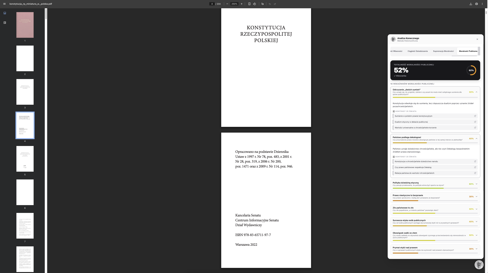
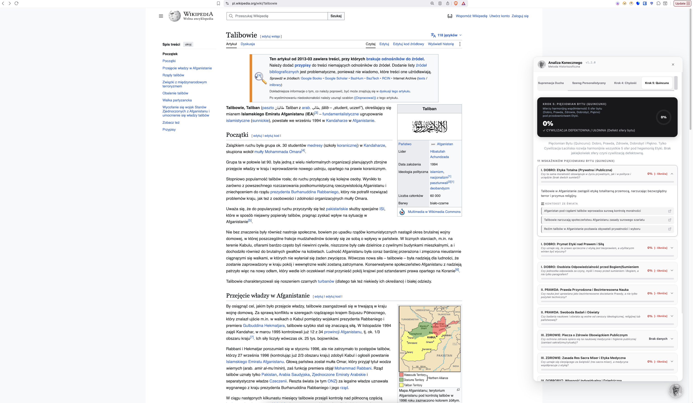

# Algorytm Konecznego

Cyfrowe narzędzie analityczne i wtyczka przeglądarkowa wdrażająca historiozoficzny **Algorytm Konecznego** do analizy cywilizacyjnej i etycznej tekstów w locie.




> **⚡ Chcesz szybko zobaczyć działanie wtyczki bez instalacji?** Wybierz jeden z gotowych raportów offline poniżej!

## 📄 Przykłady Wyników Offline (Bez Instalacji i Bez API)

Zamiast pobierać backend i konfigurację, możesz natychmiast otworzyć wyrenderowany interfejs wtyczki z wynikami analizy artykułu **Imperium Rzymskie (Wikipedia)** w nowej karcie przeglądarki:

* 🏛️ <a href="https://raw.githack.com/Pawel-Zygler/algorytm_konecznego/main/examples/Wyniki%20algorytmu%20dla%20Imperium%20Rzymskiego,%20wersja%201.2.0.%20Offline./Roman%20Empire%20-%20Wikipedia.html" target="_blank"><strong>Raport 1: Indeks Sakralności (Otwórz podgląd ↗)</strong></a>
* 🕊️ <a href="https://raw.githack.com/Pawel-Zygler/algorytm_konecznego/main/examples/Wyniki%20algorytmu%20dla%20Imperium%20Rzymskiego,%20wersja%201.2.0.%20Offline./supremacja%20ducha.htm" target="_blank"><strong>Raport 2: Supremacja Ducha – Agregacja 12 Indeksów (Otwórz podgląd ↗)</strong></a>
* ⚖️ <a href="https://raw.githack.com/Pawel-Zygler/algorytm_konecznego/main/examples/Wyniki%20algorytmu%20dla%20Imperium%20Rzymskiego,%20wersja%201.2.0.%20Offline./Roman%20Empire%20-%20Wikipedia%20-%20szereg.html" target="_blank"><strong>Raport 3: Szereg Personalistyczny – 7 Generaliów Etyki (Otwórz podgląd ↗)</strong></a>
* ⏳ <a href="https://raw.githack.com/Pawel-Zygler/algorytm_konecznego/main/examples/Wyniki%20algorytmu%20dla%20Imperium%20Rzymskiego,%20wersja%201.2.0.%20Offline./Roman%20Empire%20-%20Wikipedia%20-%20chyzosc.html" target="_blank"><strong>Raport 4: Krok 4 – Chyżość Historyczna (Otwórz podgląd ↗)</strong></a>
* ⭐️ <a href="https://raw.githack.com/Pawel-Zygler/algorytm_konecznego/main/examples/Wyniki%20algorytmu%20dla%20Imperium%20Rzymskiego,%20wersja%201.2.0.%20Offline./Roman%20Empire%20-%20Wikipedia%20-%20spojnosc%20pieciomianu.html" target="_blank"><strong>Raport 5: Krok 5 – Współmierność Pięciomianu Bytu / Quincunx (Otwórz podgląd ↗)</strong></a>
* 👁️ <a href="https://raw.githack.com/Pawel-Zygler/algorytm_konecznego/main/examples/Wyniki%20algorytmu%20dla%20Imperium%20Rzymskiego,%20wersja%201.2.0.%20Offline./Roman%20Empire%20-%20Wikipedia%20-%20eksperyment%20-%20wskaznik%20klamstwa.html" target="_blank"><strong>Raport 6: Wskaźnik Kłamstwa Cywilizacyjnego (Otwórz podgląd ↗)</strong></a>

> **Alternatywny podgląd (HTMLPreview):** [<a href="https://htmlpreview.github.io/?https://github.com/Pawel-Zygler/algorytm_konecznego/blob/main/examples/Wyniki%20algorytmu%20dla%20Imperium%20Rzymskiego,%20wersja%201.2.0.%20Offline./Roman%20Empire%20-%20Wikipedia.html" target="_blank">Otwórz przez HTMLPreview</a>] | **Katalog plików w repozytorium:** [`examples/Wyniki algorytmu dla Imperium Rzymskiego, wersja 1.2.0. Offline.`](<examples/Wyniki algorytmu dla Imperium Rzymskiego, wersja 1.2.0. Offline.>)

---

## 🛠️ Instalacja wtyczki (Tryb Online)

### Krok 1: Klonowanie repozytorium i instalacja zależności
```bash
git clone https://github.com/Pawel-Zygler/algorytm_konecznego.git
cd algorytm_konecznego
pip install -r backend/requirements.txt
pip install pytest
```

### Krok 2: Konfiguracja klucza API w backendzie (Opcjonalnie)
Skopiuj plik szablonu zmiennych środowiskowych i dodaj swój klucz do API Google Gemini:
```bash
cp backend/.env.template backend/.env
```
Otwórz plik `backend/.env` i uzupełnij:
```env
GEMINI_API_KEY=twój_działający_klucz_api
```

> **💡 Jak zdobyć darmowy klucz API?**
> Wejdź na stronę [Google AI Studio](https://aistudio.google.com/app/apikey), zaloguj się swoim kontem Google i kliknij **"Create API key"**. Wygenerowany ciąg znaków to Twój klucz, który pozwala na setki darmowych analiz dziennie.

### Krok 3: Uruchomienie serwera backendowego
Z poziomu głównego folderu uruchom serwer FastAPI:
```bash
python3 -m uvicorn backend.main:app --port 8005 --reload
```
Backend wystartuje pod adresem `http://127.0.0.1:8005`.

### Krok 4: Instalacja wtyczki w przeglądarce (Chrome/Edge)
1. Otwórz w przeglądarce stronę zarządzania wtyczkami: `chrome://extensions/` (lub `edge://extensions/`).
2. Włącz **Tryb dewelopera** (prawy górny róg).
3. Kliknij **"Załaduj rozpakowane"** ("Load unpacked").
4. Wybierz folder `extension/` z pobranego repozytorium `algorytm_konecznego`.

### Krok 5: Konfiguracja i Uruchomienie
1. Kliknij ikonę wtyczki **Analiza Konecznego** na pasku narzędzi przeglądarki Chrome.
2. Wklej swój **Klucz Gemini API** (lub TON API) w polu tekstowym *Gemini API Key*.
3. Zaznacz wybrane indeksy analityczne za pomocą checkboxów.
4. Kliknij przycisk **Zapisz Ustawienia**. Wtyczka połączy się z backendem i zapisze Twoje preferencje.
5. **Kliknij w głowę profesora w prawym dolnym rogu ekranu na dowolnej stronie, aby rozpocząć analizę jej tekstu.**

---

## 🏛️ Struktura Indeksów Analitycznych

Algorytm analizuje tekst chronologicznie w 5 krokach historiozoficznych Feliksa Konecznego:

1. **Krok 1: Indeks Sakralności**:
   - Mierzy stopień uświęcenia prawa i państwa oraz odrzucenie statolatrii i cezaropapizmu (13 wskaźników).

2. **Krok 2: Supremacja Ducha** (Agregacja 12 pod-indeksów):
   - Mierzy dominację sił duchowych nad fizyczną przymusowością w 12 obszarach:
     - **Dualizm Prawny** (`LEGAL_DUALISM_INDEX`)
     - **Pluralizm Źródeł Prawa** (`LAW_SOURCE_PLURALISM_INDEX`)
     - **Prawo Aposterioryczne vs Apriori** (`APOSTERIORI_APRIORI_INDEX`)
     - **Organizm vs Mechanizm** (`ORGANISM_MECHANISM_INDEX`)
     - **Personalizm** (`PERSONALISM_INDEX`)
     - **Autonomia Rodziny** (`FAMILY_LAW_AUTONOMY_INDEX`)
     - **Niezależność Kościoła** (`CHURCH_INDEPENDENCE_INDEX`)
     - **Stabilność Własności** (`PROPERTY_RIGHTS_STABILITY_INDEX`)
     - **Ciągłość Dziedziczenia** (`INHERITANCE_CONTINUITY_INDEX`)
     - **Supremacja Moralności** (`MORALITY_SUPREMACY_INDEX`)
     - **Totalność Moralności Publicznej** (`PUBLIC_MORALITY_TOTALITY_INDEX`)
     - **Odpowiedzialność Urzędnicza** (`ADMINISTRATIVE_RESPONSIBILITY_INDEX`)

3. **Krok 3: Szereg Personalistyczny (Generalia Etyki - Siedem Niewiadomych)**:
   - Wylicza wskaźnik spójności etycznej (`ethical_coherence_score`) oraz diagnozuje **Szereg Personalistyczny** (Cywilizacja Łacińska) vs **Szereg Gromadnościowy** vs **⚠️ Mieszankę Trującą** (stan acywilizacyjny).
   - Zawiera 7 pod-indeksów etycznych:
     - **Personalistyczne Źródło Obowiązku** (`duty_source` - 13 wskaźników)
     - **Motywacja i Bezinteresowność** (`motivation` - 14 wskaźników)
     - **Natura Sprawiedliwości** (`justice_nature` - 16 wskaźników)
     - **Status Sumienia: Autonomia vs Heteronomia** (`conscience_status` - 15 wskaźników)
     - **Opanowanie Czasu i Historyzm** (`time_mastery` - 15 wskaźników)
     - **Ethos Pracy i Uświęcenie** (`work_ethos` - 14 wskaźników)

4. **Krok 4: Chyżość Historyczna (Wydajność Cywilizacyjna)**:
   - Mierzy zdolność społeczności do **kapitalizowania i oszczędzania czasu** dla przyszłych pokoleń (zamiast powracania do stanu początkowego *ab ovo*).

5. **Krok 5: Współmierność Pięciomianu Bytu (QUINCUNX_COHERENCE_INDEX)**:
   - Badanie harmonijnej spójności 5 sfer bytu (Dobro, Prawda, Zdrowie, Dobrobyt, Piękno) wyliczane za pomocą średniej geometrycznej $\sqrt[5]{D \cdot P \cdot Z \cdot Db \cdot Pi}$ oraz mnożnika spójności $Consistency\_Factor$.

---

> **Uwaga dotycząca złożoności (Cost/Quota):** Pełna wersja analizy (ze wszystkimi włączonymi checkboxami) wysyła równolegle **24 zapytania (prompty)** do modelu LLM. Łącznie w ramach jednej analizy tekstu ewaluowane są aż **352 szczegółowe pytania/kryteria** dla pod-wskaźników! Z tego powodu należy uważać na limity darmowego API (Quota 429). Gdy wybieramy jeden bądź kilka indeksów, powinno nam starczyć na kilkanaście zapytań.