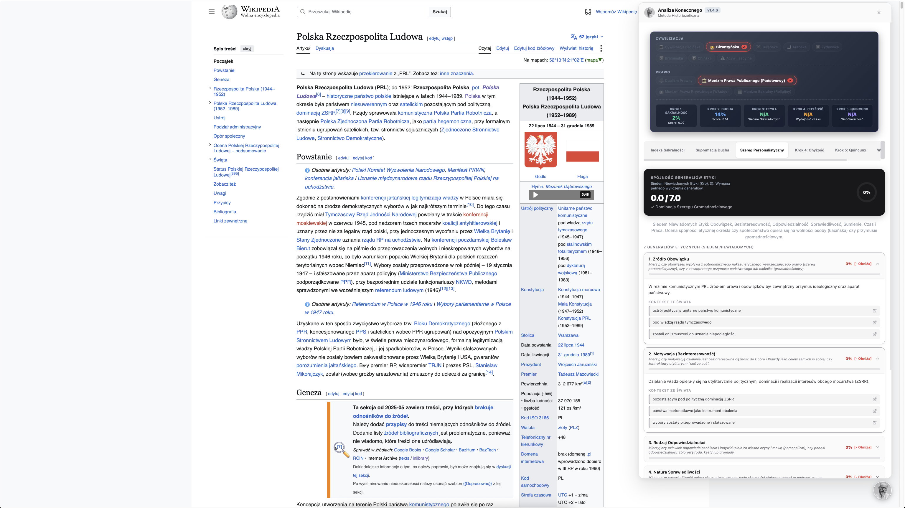

# Algorytm Konecznego

Dzieła i teoria Konecznego zamienione w cyfrowe narzędzie, praktyczny pomost od monografij do metody indukcyjnej umożliwiający badanie quincunxa, trójprawa oraz ścierania się cywilizacyj i etyk w tekstach.




<details>
<summary><b>Przykłady Wyników Offline (Bez Instalacji i Bez API)</b></summary>

Zamiast pobierać backend i konfigurację, możesz natychmiast otworzyć gotowe wyrenderowane raporty z analizy artykułu **Imperium Rzymskie (Wikipedia)** w nowej karcie przeglądarki:

* <a href="https://raw.githack.com/Pawel-Zygler/algorytm_konecznego/main/examples/offline-roman-empire/1-indeks-sakralnosci.html" target="_blank"><strong>Raport 1: Indeks Sakralności (Otwórz w nowej karcie ↗)</strong></a>
* <a href="https://raw.githack.com/Pawel-Zygler/algorytm_konecznego/main/examples/offline-roman-empire/2-supremacja-ducha.html" target="_blank"><strong>Raport 2: Supremacja Ducha – Agregacja 12 Indeksów (Otwórz w nowej karcie ↗)</strong></a>
* <a href="https://raw.githack.com/Pawel-Zygler/algorytm_konecznego/main/examples/offline-roman-empire/3-szereg-personalistyczny.html" target="_blank"><strong>Raport 3: Szereg Personalistyczny – 7 Generaliów Etyki (Otwórz w nowej karcie ↗)</strong></a>
* <a href="https://raw.githack.com/Pawel-Zygler/algorytm_konecznego/main/examples/offline-roman-empire/4-chyzosc-historyczna.html" target="_blank"><strong>Raport 4: Krok 4 – Chyżość Historyczna (Otwórz w nowej karcie ↗)</strong></a>
* <a href="https://raw.githack.com/Pawel-Zygler/algorytm_konecznego/main/examples/offline-roman-empire/5-quincunx-pieciomian.html" target="_blank"><strong>Raport 5: Krok 5 – Współmierność Pięciomianu Bytu / Quincunx (Otwórz w nowej karcie ↗)</strong></a>
* <a href="https://raw.githack.com/Pawel-Zygler/algorytm_konecznego/main/examples/offline-roman-empire/6-wskaznik-klamstwa.html" target="_blank"><strong>Raport 6: Wskaźnik Kłamstwa Cywilizacyjnego (Otwórz w nowej karcie ↗)</strong></a>

</details>

<details>
<summary><b>Instalacja wtyczki (Tryb Online)</b></summary>

### Krok 1: Klonowanie repozytorium i instalacja zależności
```bash
git clone https://github.com/Pawel-Zygler/algorytm_konecznego.git
cd algorytm_konecznego
pip install -r backend/requirements.txt
pip install pytest
```

### Krok 2: Konfiguracja klucza API w backendzie (Opcjonalnie)
Skopiuj plik szablonu zmiennych środowiskowych i dodaj swój klucz do API Google Gemini lub Ollama:
```bash
cp backend/.env.template backend/.env
```
Otwórz plik `backend/.env` i uzupełnij:
```env
GEMINI_API_KEY=twój_działający_klucz_api
```

> **Jak zdobyć darmowy klucz API Google Gemini?**
> Wejdź na stronę [Google AI Studio](https://aistudio.google.com/app/apikey), zaloguj się swoim kontem Google i kliknij **"Create API key"**. Wygenerowany ciąg znaków to Twój darmowy klucz API.

### Krok 3: Uruchomienie serwera backendowego
Z poziomu głównego folderu uruchom serwer FastAPI:
```bash
python3 -m uvicorn backend.main:app --port 8005 --reload
```
Backend wystartuje pod adresem `http://127.0.0.1:8005`.

### Krok 4: Instalacja wtyczki w przeglądarce (Chrome/Edge)
1. Otwórz w przeglądarce stronę zarządzania wtyczkami: `chrome://extensions/` (lub `edge://extensions/`).
2. Włącz **Tryb dewelopera** (prawy górny róg).
3. Kliknij **"Załaduj rozpakowane"** ("Load unpacked").
4. Wybierz folder `extension/` z pobranego repozytorium `algorytm_konecznego`.

### Krok 5: Konfiguracja i Uruchomienie
1. Kliknij ikonę wtyczki **Analiza Konecznego** na pasku narzędzi przeglądarki Chrome.
2. Wklej swój **Klucz API** w polu tekstowym *Klucz API*.
3. Zaznacz wybrane indeksy analityczne za pomocą checkboxów.
4. Kliknij przycisk **Zapisz Ustawienia**. Wtyczka połączy się z backendem i zapisze Twoje preferencje.
5. **Kliknij w głowę profesora w prawym dolnym rogu ekranu na dowolnej stronie, aby rozpocząć analizę jej tekstu.**

</details>

<details>
<summary><b>Lokalny Dostawca LLM (Ollama) – Brak Opłat i Brak Quota 429</b></summary>

Aby całkowicie wyeliminować opóźnienia i limity darmowego API Gemini (Quota 429), możesz uruchamiać analizy w 100% lokalnie na własnym komputerze przy użyciu usługi **Ollama**.

### 1. Instalacja Ollama
Pobierz i zainstaluj darmową aplikację: [ollama.com](https://ollama.com).

### 2. Pobranie i uruchomienie modelu
Wystarczy uruchomić w terminalu komendę dla wybranego modelu:

* **GLM-5.2 / GLM-4 (Rekomendowane)**:
  ```bash
  ollama run glm-5.2:cloud
  # lub w pełni lokalna wersja GLM-4:
  ollama run glm4
  ```
* **Szybki i lekki model Qwen 2.5 (1.9 GB)**:
  ```bash
  ollama run qwen2.5:3b
  ```

### 3. Konfiguracja we wtyczce
W oknie ustawień wtyczki w polu **Klucz API** wpisz nazwę modelu z prefiksem `ollama:`, np.:
* `ollama:glm-5.2`
* `ollama:glm4`
* `ollama:qwen2.5:3b`

Po zapisaniu ustawień backend automatycznie przełączy się na lokalny serwer Ollama (`http://localhost:11434`).

</details>

<details>
<summary><b>Struktura Indeksów Analitycznych</b></summary>

Algorytm analizuje tekst chronologicznie w 5 krokach historiozoficznych Feliksa Konecznego:

1. **Krok 1: Indeks Sakralności**:
   - Mierzy stopień uświęcenia prawa i państwa oraz odrzucenie statolatrii i cezaropapizmu (13 wskaźników).

2. **Krok 2: Supremacja Ducha** (Agregacja 12 pod-indeksów):
   - Mierzy dominację sił duchowych nad fizyczną przymusowością w 12 obszarach:
     - **Dualizm Prawny** (`LEGAL_DUALISM_INDEX`)
     - **Pluralizm Źródeł Prawa** (`LAW_SOURCE_PLURALISM_INDEX`)
     - **Prawo Aposterioryczne vs Apriori** (`APOSTERIORI_APRIORI_INDEX`)
     - **Organizm vs Mechanizm** (`ORGANISM_MECHANISM_INDEX`)
     - **Personalizm** (`PERSONALISM_INDEX`)
     - **Autonomia Rodziny** (`FAMILY_LAW_AUTONOMY_INDEX`)
     - **Niezależność Kościoła** (`CHURCH_INDEPENDENCE_INDEX`)
     - **Stabilność Własności** (`PROPERTY_RIGHTS_STABILITY_INDEX`)
     - **Ciągłość Dziedziczenia** (`INHERITANCE_CONTINUITY_INDEX`)
     - **Supremacja Moralności** (`MORALITY_SUPREMACY_INDEX`)
     - **Totalność Moralności Publicznej** (`PUBLIC_MORALITY_TOTALITY_INDEX`)
     - **Odpowiedzialność Urzędnicza** (`ADMINISTRATIVE_RESPONSIBILITY_INDEX`)

3. **Krok 3: Szereg Personalistyczny (Generalia Etyki - Siedem Niewiadomych)**:
   - Wylicza wskaźnik spójności etycznej (`ethical_coherence_score`) oraz diagnozuje **Szereg Personalistyczny** (Cywilizacja Łacińska) vs **Szereg Gromadnościowy** vs **Mieszankę Trującą** (stan acywilizacyjny).
   - Zawiera 7 pod-indeksów etycznych:
     - **Personalistyczne Źródło Obowiązku** (`duty_source` - 13 wskaźników)
     - **Motywacja i Bezinteresowność** (`motivation` - 14 wskaźników)
     - **Natura Sprawiedliwości** (`justice_nature` - 16 wskaźników)
     - **Status Sumienia: Autonomia vs Heteronomia** (`conscience_status` - 15 wskaźników)
     - **Opanowanie Czasu i Historyzm** (`time_mastery` - 15 wskaźników)
     - **Ethos Pracy i Uświęcenie** (`work_ethos` - 14 wskaźników)

4. **Krok 4: Chyżość Historyczna (Wydajność Cywilizacyjna)**:
   - Mierzy zdolność społeczności do **kapitalizowania i oszczędzania czasu** dla przyszłych pokoleń (zamiast powracania do stanu początkowego *ab ovo*).

5. **Krok 5: Współmierność Pięciomianu Bytu (QUINCUNX_COHERENCE_INDEX)**:
   - Badanie harmonijnej spójności 5 sfer bytu (Dobro, Prawda, Zdrowie, Dobrobyt, Piękno) wyliczane za pomocą średniej geometrycznej $\sqrt[5]{D \cdot P \cdot Z \cdot Db \cdot Pi}$ oraz mnożnika spójności $Consistency\_Factor$.

</details>

---

> **Uwaga dotycząca limitów zapytań (Quota 429 w darmowym planie Gemini API):** Pełna wersja analizy (ze wszystkimi włączonymi checkboxami) wysyła równolegle **24 zapytania (prompty)** do modelu LLM. Łącznie w ramach jednej analizy tekstu ewaluowane są aż **352 szczegółowe pytania/kryteria** dla pod-wskaźników.
> - **W darmowej wersji Google Gemini API (Free Tier)** obowiązuje limit RPM/RPD, przez co serwer może nakładać kilkusekundowe opóźnienia retrujące (Quota 429).
> - **Dla nielimitowanych zapytań bez opłat i bez limitów:** Zaznaczaj wybrane pojedyncze indeksy we wtyczce lub uruchom lokalnego dostawcę **Ollama** (`ollama:glm-5.2`).