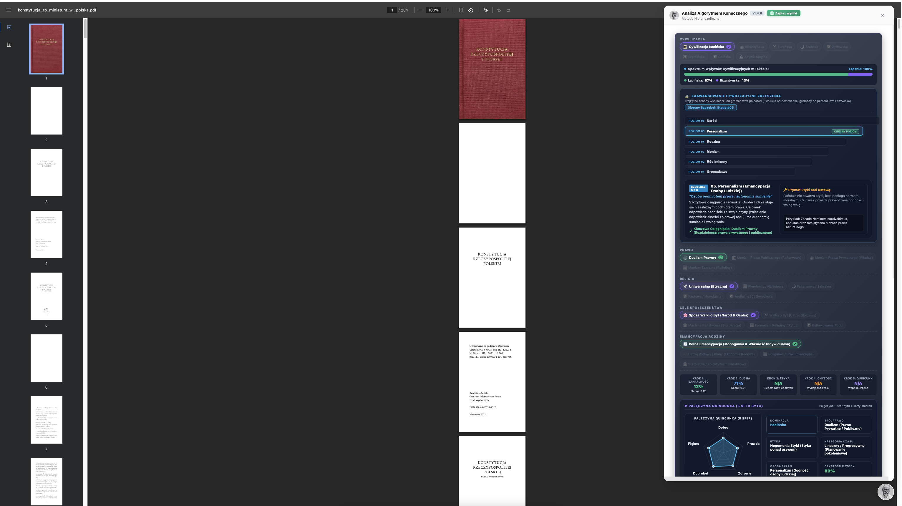
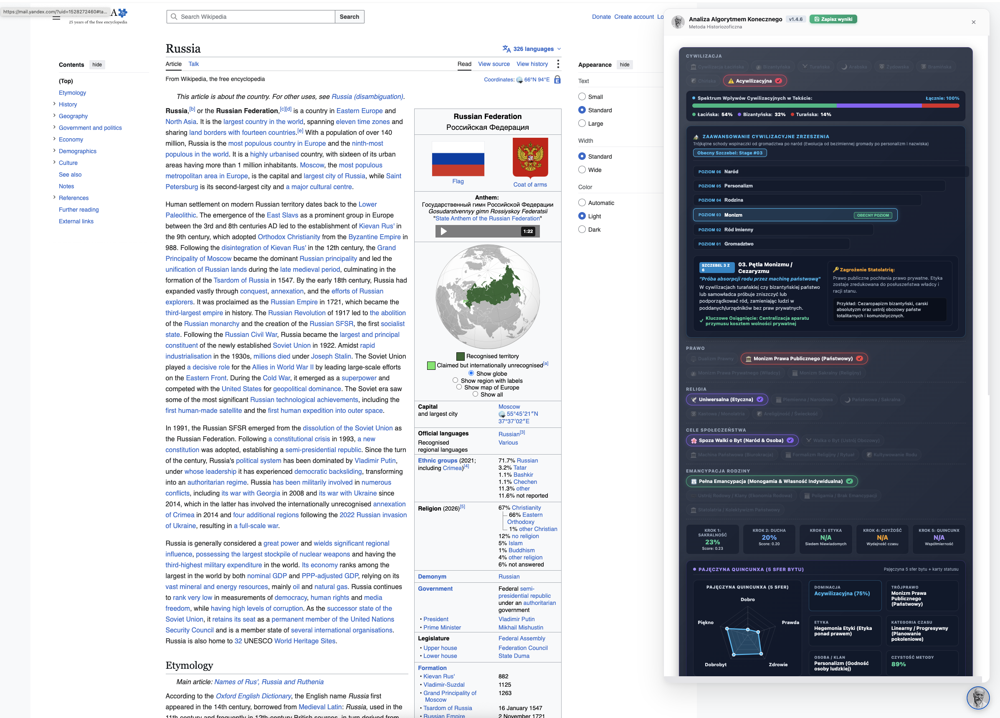
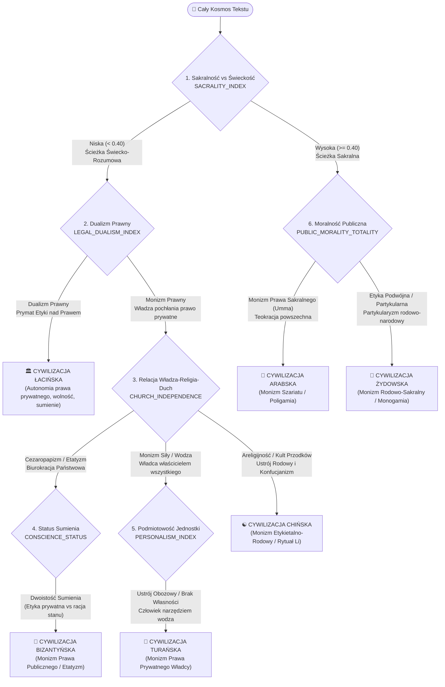

# Algorytm Konecznego

Dzieła i teoria Konecznego zamienione w cyfrowe narzędzie, praktyczny pomost od monografij do metody indukcyjnej umożliwiający badanie quincunxa, trójprawa oraz ścierania się cywilizacyj i etyk w tekstach.




<details>
<summary><b>Przykłady Wyników Offline (Bez Instalacji i Bez API)</b></summary>

Zamiast pobierać backend i konfigurację, możesz natychmiast otworzyć gotowe wyrenderowane raporty z analizy artykułu **Imperium Rzymskie (Wikipedia)** w nowej karcie przeglądarki:

* <a href="https://raw.githack.com/Pawel-Zygler/algorytm_konecznego/main/examples/offline-roman-empire/1-indeks-sakralnosci.html" target="_blank"><strong>Raport 1: Indeks Sakralności (Otwórz w nowej karcie ↗)</strong></a>
* <a href="https://raw.githack.com/Pawel-Zygler/algorytm_konecznego/main/examples/offline-roman-empire/2-supremacja-ducha.html" target="_blank"><strong>Raport 2: Supremacja Ducha – Agregacja 12 Indeksów (Otwórz w nowej karcie ↗)</strong></a>
* <a href="https://raw.githack.com/Pawel-Zygler/algorytm_konecznego/main/examples/offline-roman-empire/3-szereg-personalistyczny.html" target="_blank"><strong>Raport 3: Szereg Personalistyczny – 7 Generaliów Etyki (Otwórz w nowej karcie ↗)</strong></a>
* <a href="https://raw.githack.com/Pawel-Zygler/algorytm_konecznego/main/examples/offline-roman-empire/4-chyzosc-historyczna.html" target="_blank"><strong>Raport 4: Krok 4 – Chyżość Historyczna (Otwórz w nowej karcie ↗)</strong></a>
* <a href="https://raw.githack.com/Pawel-Zygler/algorytm_konecznego/main/examples/offline-roman-empire/5-quincunx-pieciomian.html" target="_blank"><strong>Raport 5: Krok 5 – Współmierność Pięciomianu Bytu / Quincunx (Otwórz w nowej karcie ↗)</strong></a>
* <a href="https://raw.githack.com/Pawel-Zygler/algorytm_konecznego/main/examples/offline-roman-empire/6-wskaznik-klamstwa.html" target="_blank"><strong>Raport 6: Wskaźnik Kłamstwa Cywilizacyjnego (Otwórz w nowej karcie ↗)</strong></a>

</details>

<details>
<summary><b>Instalacja wtyczki (Tryb Online)</b></summary>

### Krok 1: Klonowanie repozytorium i instalacja zależności
```bash
git clone https://github.com/Pawel-Zygler/algorytm_konecznego.git
cd algorytm_konecznego
pip install -r backend/requirements.txt
pip install pytest
```

### Krok 2: Konfiguracja klucza API w backendzie (Opcjonalnie)
Skopiuj plik szablonu zmiennych środowiskowych i dodaj swój klucz do API Google Gemini lub Ollama:
```bash
cp backend/.env.template backend/.env
```
Otwórz plik `backend/.env` i uzupełnij:
```env
GEMINI_API_KEY=twój_działający_klucz_api
```

> **Jak zdobyć darmowy klucz API Google Gemini?**
> Wejdź na stronę [Google AI Studio](https://aistudio.google.com/app/apikey), zaloguj się swoim kontem Google i kliknij **"Create API key"**. Wygenerowany ciąg znaków to Twój darmowy klucz API.

### Krok 3: Uruchomienie serwera backendowego
Wystarczy wpisać w terminalu jedną z prostych komend:
```bash
make start
# lub:
./start.sh
# lub:
python3 start.py
```
Backend wystartuje pod adresem `http://127.0.0.1:8005`.

### Krok 4: Instalacja wtyczki w przeglądarce (Chrome/Edge)
1. Otwórz w przeglądarce stronę zarządzania wtyczkami: `chrome://extensions/` (lub `edge://extensions/`).
2. Włącz **Tryb dewelopera** (prawy górny róg).
3. Kliknij **"Załaduj rozpakowane"** ("Load unpacked").
4. Wybierz folder `extension/` z pobranego repozytorium `algorytm_konecznego`.

### Krok 5: Konfiguracja i Uruchomienie
1. Kliknij ikonę wtyczki **Analiza Konecznego** na pasku narzędzi przeglądarki Chrome.
2. Wklej swój **Klucz API** w polu tekstowym *Klucz API*.
3. Zaznacz wybrane indeksy analityczne za pomocą checkboxów.
4. Kliknij przycisk **Zapisz Ustawienia**. Wtyczka połączy się z backendem i zapisze Twoje preferencje.
5. **Kliknij w głowę profesora w prawym dolnym rogu ekranu na dowolnej stronie, aby rozpocząć analizę jej tekstu.**

</details>

<details>
<summary><b>Struktura Indeksów Analitycznych</b></summary>

Algorytm analizuje tekst chronologicznie w 5 krokach historiozoficznych Feliksa Konecznego:

1. **Krok 1: Indeks Sakralności**:
   - Mierzy stopień uświęcenia prawa i państwa oraz odrzucenie statolatrii i cezaropapizmu (13 wskaźników).

2. **Krok 2: Supremacja Ducha** (Agregacja 12 pod-indeksów):
   - Mierzy dominację sił duchowych nad fizyczną przymusowością w 12 obszarach:
     - **Dualizm Prawny** (`LEGAL_DUALISM_INDEX`)
     - **Pluralizm Źródeł Prawa** (`LAW_SOURCE_PLURALISM_INDEX`)
     - **Prawo Aposterioryczne vs Apriori** (`APOSTERIORI_APRIORI_INDEX`)
     - **Organizm vs Mechanizm** (`ORGANISM_MECHANISM_INDEX`)
     - **Personalizm** (`PERSONALISM_INDEX`)
     - **Autonomia Rodziny** (`FAMILY_LAW_AUTONOMY_INDEX`)
     - **Niezależność Kościoła** (`CHURCH_INDEPENDENCE_INDEX`)
     - **Stabilność Własności** (`PROPERTY_RIGHTS_STABILITY_INDEX`)
     - **Ciągłość Dziedziczenia** (`INHERITANCE_CONTINUITY_INDEX`)
     - **Supremacja Moralności** (`MORALITY_SUPREMACY_INDEX`)
     - **Totalność Moralności Publicznej** (`PUBLIC_MORALITY_TOTALITY_INDEX`)
     - **Odpowiedzialność Urzędnicza** (`ADMINISTRATIVE_RESPONSIBILITY_INDEX`)

3. **Krok 3: Szereg Personalistyczny (Generalia Etyki - Siedem Niewiadomych)**:
   - Wylicza wskaźnik spójności etycznej (`ethical_coherence_score`) oraz diagnozuje **Szereg Personalistyczny** (Cywilizacja Łacińska) vs **Szereg Gromadnościowy** vs **Mieszankę Trującą** (stan acywilizacyjny).
   - Zawiera 7 pod-indeksów etycznych:
     - **Personalistyczne Źródło Obowiązku** (`duty_source` - 13 wskaźników)
     - **Motywacja i Bezinteresowność** (`motivation` - 14 wskaźników)
     - **Natura Sprawiedliwości** (`justice_nature` - 16 wskaźników)
     - **Status Sumienia: Autonomia vs Heteronomia** (`conscience_status` - 15 wskaźników)
     - **Opanowanie Czasu i Historyzm** (`time_mastery` - 15 wskaźników)
     - **Ethos Pracy i Uświęcenie** (`work_ethos` - 14 wskaźników)

4. **Krok 4: Chyżość Historyczna (Wydajność Cywilizacyjna)**:
   - Mierzy zdolność społeczności do **kapitalizowania i oszczędzania czasu** dla przyszłych pokoleń (zamiast powracania do stanu początkowego *ab ovo*).

5. **Krok 5: Współmierność Pięciomianu Bytu (QUINCUNX_COHERENCE_INDEX)**:
   - Badanie harmonijnej spójności 5 sfer bytu (Dobro, Prawda, Zdrowie, Dobrobyt, Piękno) wyliczane za pomocą średniej geometrycznej $\sqrt[5]{D \cdot P \cdot Z \cdot Db \cdot Pi}$ oraz mnożnika spójności $Consistency\_Factor$.

</details>

<details>
<summary><b>Tryby Pracy Silnika: Full, Lite oraz Mantis (Drapieżna Modliszka Decyzyjna)</b></summary>

System *Algorytm Konecznego* wspiera trzy komplementarne tryby ewaluacji tekstu, zoptymalizowane pod kątem głębokości historiozoficznej, zużycia tokenów oraz szybkości:

### 1. 🦗 Wersja Mantis (Drapieżna Modliszka — Reguła Pareto 80/20)
*Mantis* to drapieżny, ultra-precyzyjny silnik klasyfikacji o wysokiej wydajności. Zamiast analizować wszystkie 27 indeksów naraz, **wykorzystuje Zasadę Pareto (20% kluczowych indeksów rozstrzyga 80%+ przypadków)**. 

Działa jak polująca modliszka: przechodzi sekwencyjnie przez logiczne bramki decyzyjne (*Information Gain Decision Gates*), błyskawicznie identyfikując cywilizację badanego tekstu przy minimalnym zużyciu zapytań LLM.

```text
                       [CAŁY KOSMOS TEKSTU]
                                │
          1. SACRALITY_INDEX (Sakralność vs Świeckość)
                 ┌──────────────┴──────────────┐
         [Niska < 0.40]                 [Wysoka >= 0.40]
  (Łac / Biz / Tur / CHIŃSKA)          (Arab / Żyd / Bram)
                 │                              │
 2. LEGAL_DUALISM_INDEX         6. PUBLIC_MORALITY_TOTALITY
 (Dualizm vs Monizm Prawa)      (Etyka podwójna vs jednolita)
        ┌────────┴────────┐             ┌───────┴───────┐
   [Dualizm]          [Monizm]      [Monizm Prawa]   [Etyka Podwójna]
       │                  │                │                │
       ▼                  │                ▼                ▼
   ŁACIŃSKA               │             ARABSKA         ŻYDOWSKA
                          │
  3. RELACJA WŁADZA - DUCH - SPOŁECZEŃSTWO
         ┌────────────────┼─────────────────────┐
  [Cezaropapizm]    [Monizm Siły]      [Areligijność / Kult Rodu]
         │                │                     │
  4. CONSCIENCE     5. PERSONALISM        7. RYTUAŁ & RÓD
  (Dwoistość)       (Ustrój Obozowy)   (Konfucjanizm, Rytuał 'Li')
         │                │                     │
         ▼                ▼                     ▼
    BIZANTYŃSKA        TURAŃSKA              CHIŃSKA
```



#### Kluczowe Bramki Decyzyjne Mantisa (Złota 6-tka Pareto):
1. **`SACRALITY_INDEX`** – Rozcina rzeczywistość na cywilizacje sakralne (Arabska, Żydowska, Bramińska) i świecko-rozumowe (Łacińska, Bizantyńska, Turańska, Chińska).
2. **`LEGAL_DUALISM_INDEX`** – Skalpel wyróżniający cywilizację łacińską (rozdział i autonomia prawa prywatnego wobec publicznego).
3. **`CHURCH_INDEPENDENCE_INDEX`** – Weryfikuje cezaropapizm i etatyzm (Bizancjum) vs dominację siły fizycznej (Turan) vs areligijny kult rodu i etykietę konfucjańską (Chiny) vs niezależność sumienia (Łacina).
4. **`CONSCIENCE_STATUS_INDEX`** – Bada jedność moralną sumienia vs podwójną moralność (inne zasady prywatnie, inne dla „racji stanu”).
5. **`PERSONALISM_INDEX`** – Wykrywa ustrój obozowy, brak stabilnej własności i redukcję człowieka do roli żołnierza/narzędzia wodza (Turańszczyzna).
6. **`PUBLIC_MORALITY_TOTALITY_INDEX`** – Weryfikuje powszechny monizm sakralny (Arabska/Umma) vs podwójną etykę rodowo-narodową (Żydowska/Halacha).

---

### 2. ⚡ Wersja Lite (Szybka Eksploracja)
* Tryb zoptymalizowany pod kątem natychmiastowej orientacji w treści artykułu.
* Ewaluuje **3 nadrzędne indeksy agregujące**: Ogólną Sakralność, Ogólną Supremację Ducha oraz Wskaźnik Spójności Etycznej.
* Wykorzystuje 3-4 zwięzłe zapytania promptowe, zwracając szybki orientacyjny profil cywilizacyjny w kilka sekund.

---

### 3. 🏛️ Wersja Full (Pełna Synteza Historiozoficzna)
* Kompletne, bezkompromisowe cyfrowe odwzorowanie metodologii Feliksa Konecznego.
* Bada wszystkie **27 indeksów analitycznych** rozbitych na **352 szczegółowe pytania kwalifikacyjne**:
  * Pełna pajęczyna **Quincunxa (Pięciomianu Bytu)** z wyliczeniem średniej geometrycznej i współmierności sfer.
  * Pełna dekompozycja **Siedmiu Niewiadomych (Szereg Personalistyczny)**.
  * Weryfikacja **Wskaźnika Kłamstwa Cywilizacyjnego** (5 wektorów rozkładu).
  * Dokładne spektrum procentowe wpływów cywilizacyjnych i weryfikacja synkretyzmu.

</details>

---

> **Uwaga dotycząca limitów zapytań (Quota 429 w darmowym planie Gemini API):** Pełna wersja analizy (Full) wysyła równolegle **24 zapytania (prompty)** do modelu LLM, ewaluując aż **352 szczegółowe kryteria**.
> - **Dla szybkiej analizy z zachowaniem precyzji:** Wybierz tryb **Mantis** (Pareto 80/20) lub **Lite**.